# Top 12 Best AI Video Clipping Tools in 2025

Sitting on hours of podcast footage or webinar recordings but zero time to edit them into snappy social clips? Your long-form content deserves a second life on TikTok, Instagram Reels, and YouTube Shorts, but manually scrubbing through timelines hunting for viral moments kills productivity. AI video clipping tools automatically scan your videos, identify engaging segments, add captions, and package everything into platform-ready short clips—transforming one 60-minute video into 10+ shareable pieces without touching a timeline.

***

## **[Opus.pro](https://www.opus.pro)**

AI-powered video repurposing platform that turns long content into viral clips with virality scoring and one-click publishing for creators managing multiple social channels.

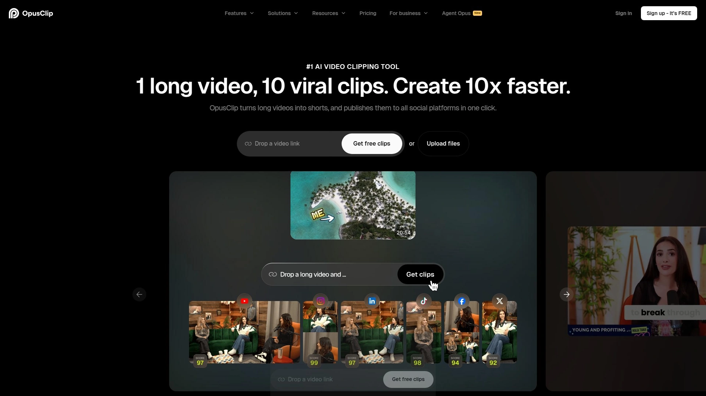

OpusClip processes videos from podcasts, webinars, and educational content, extracting multiple short clips from a single upload. The standout feature is the **AI Virality Score**, which analyzes thousands of viral videos to predict each clip's success potential before you publish. This data-driven approach helps prioritize which clips deserve your attention instead of guessing what might perform.

Active speaker detection keeps the main subject centered in frame throughout clips, while AI keyword highlighting emphasizes important terms in captions to boost watch time by up to 45%. The platform supports English, German, Spanish, French, and Portuguese with auto-captioning accuracy that makes content accessible globally. Custom branding lets you create up to 5 brand templates for consistent visual identity across all videos.

Caption animations increase retention, and the upcoming AI b-roll integration will automatically supplement clips with relevant stock footage. The ClipGenius feature streamlines workflows significantly—most users report creating 100+ short videos monthly from their existing content library. Setup involves uploading your video, selecting target platforms (TikTok, Instagram, YouTube Shorts, LinkedIn), and watching the AI generate multiple clips ready for distribution.

***

## **[Vizard.ai](https://vizard.ai)**

Web-based AI editor using voice and image recognition to transform podcasts and webinars into platform-optimized clips with automated transcription and speaker identification.

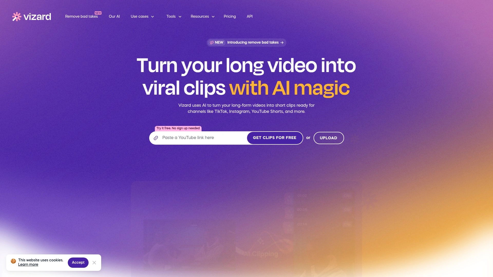

Vizard.ai excels at repurposing long-form video for creators, marketers, and agencies who need consistent social content without expanding their team. Upload your video and the AI transcribes everything, identifies speakers, and processes footage automatically—no manual tagging required. The **"Get AI clips"** button generates fully-designed vertical clips formatted specifically for TikTok, YouTube Shorts, and Instagram Reels with proper aspect ratios and engaging layouts.

The platform handles videos of substantial length, making it practical for multi-hour podcast episodes or full-day conference recordings. Auto-generated clips include professional headlines and subtitles, plus social post descriptions ready to copy-paste. Text-based editing lets you trim videos by editing the transcript like a document—cutting spoken words automatically removes corresponding video segments.

Translation functionality supports 29 languages, expanding your content's global reach without additional production work. Publishing options include direct downloads, shareable links, or one-click posting to connected social accounts. The workflow saves marketing teams roughly 25 hours monthly by eliminating manual clip creation.

***

## **[Klap](https://klap.app)**

Intelligent clip generator that identifies engaging video segments and converts them into viral-ready shorts with automatic captioning and smart reframing for vertical formats.

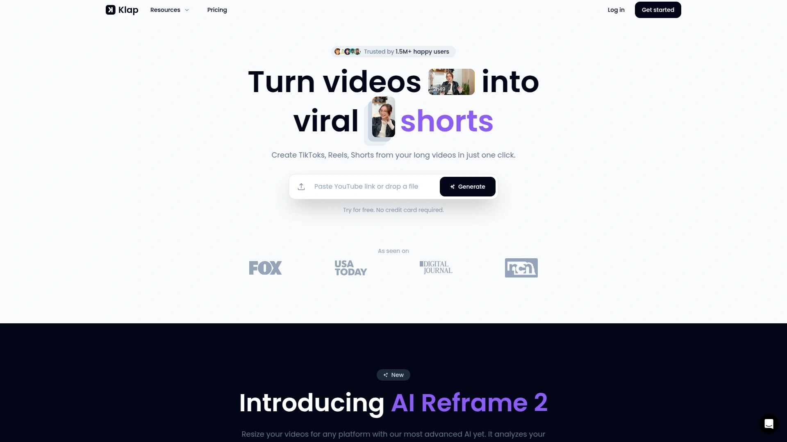

Klap focuses on speed and simplicity—upload your long video and the AI quickly selects the most compelling moments worth sharing. The platform analyzes content to find natural story arcs and attention-grabbing segments, then automatically reformats everything for mobile viewing. Context-aware captions adapt to your content type, whether educational, entertainment, or product-focused.

Smart reframing automatically centers subjects in vertical 9:16 layouts without cutting off important visual elements. This matters when converting landscape podcast recordings or webinars filmed in standard widescreen formats. The tool dramatically reduces editing time—what used to take hours of manual timeline work now finishes in minutes.

YouTube video imports happen seamlessly, making it simple to repurpose existing channel content for Shorts distribution. No credit card required for initial testing, letting you process sample videos before committing to paid plans. The interface prioritizes accessibility for non-editors while delivering professional-quality results suitable for branded content.

---

## **[Spikes Studio](https://www.spikes.studio)**

AI clip generator designed for gaming, streaming, and social content creators handling videos up to 24 hours long with personalized editing that improves through usage.

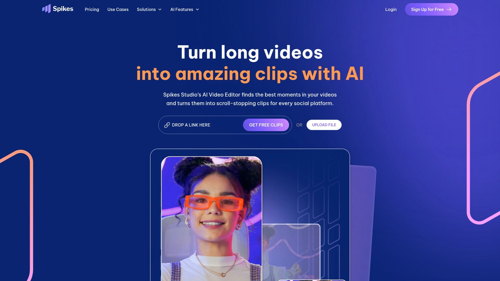

Spikes Studio processes content from YouTube, Twitch, TikTok, and Instagram Reels, converting lengthy streams and videos into shareable viral clips. The AI handles videos up to 24 hours in duration—a necessity for marathon gaming streams, multi-session workshops, or all-day event coverage. Scene detection and real-time face tracking keep key elements properly framed when auto-cropping to vertical formats.

Auto-captions generate with word-level precision, syncing text perfectly with speech even in fast-paced content like gaming commentary or energetic presentations. The AI learning system adapts to your editing preferences over time, gradually understanding which clip styles and lengths perform best for your specific audience. Advanced video editor provides control when you need manual adjustments beyond automated suggestions.

QR code downloads let you instantly transfer clips to mobile devices for quick on-the-go posting. Discord support connects you directly with the development team and creator community for troubleshooting and feature requests. Future updates will include automatic hashtag and description generation to streamline the entire publishing workflow.

---

## **[VEED.IO](https://www.veed.io)**

Online video editor with AI Clips feature powered by Sieve technology that creates social-first video clips from long content with instant repurposing capabilities.

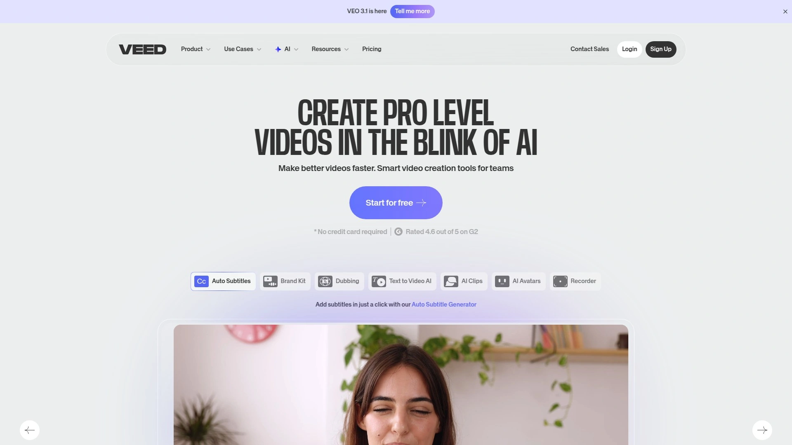

VEED.IO's Clips tool analyzes uploaded videos for highlights, automatically selecting best moments and cleaning audio in one action. Upload videos longer than two minutes with spoken audio, select your preferred clip length and goal (viral shorts, highlights, or insights), and receive multiple customized clips within minutes. The AI auto-generates subtitles, centers speakers in frame, and removes filler words simultaneously.

Clips export immediately or load into VEED's full editor for additional customization—add branding elements, animations, music from royalty-free libraries, or trending sounds from TikTok's Commercial Music Library via the TikTok Symphony Assistant add-on. Content Scheduler built into the platform lets you publish clips directly to Instagram Reels, TikTok, YouTube Shorts, and other channels when your audience is most active.

Goal-based clip generation adapts output to your specific needs—marketing teams request promo-focused cuts while educators extract teaching moments from recorded lectures. The platform handles compilation video creation, converting text to video, and manual editing through an intuitive interface suitable for beginners. VEED combines automation with creative flexibility for teams producing regular social content.

***

## **[InVideo AI](https://invideo.io)**

Text-to-video clip generator with generative media capabilities that creates short-form content from simple prompts, trusted by 25 million users across 190 countries.

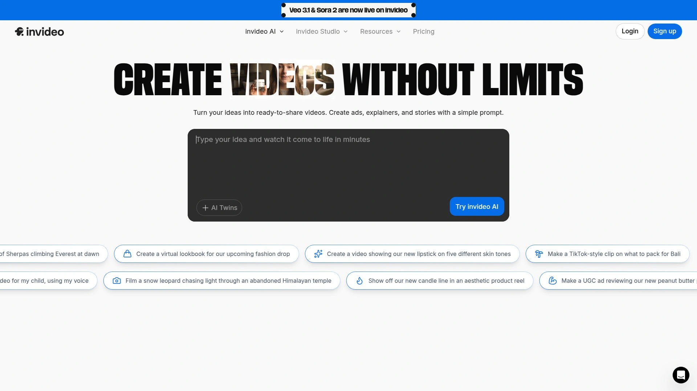

InVideo AI takes a different approach—type your video clip idea with character and element details, and the platform generates complete videos with AI-created images, voiceovers, background music, and sound effects. The Magic Box editing feature accepts natural language commands like "change the accent," "delete scenes," or "change language" to modify generated clips instantly.

Voice engine adds ultra-realistic narration in 50+ languages, replacing expensive voice artists with automated alternatives that sound human. This functionality serves marketers creating ads, promos, and social videos without recording budgets. The AI generates both media assets and video structure, eliminating the need to juggle multiple tools for stock footage, audio, and editing.

Aspect ratio presets optimize clips for TikTok, YouTube Shorts, and Instagram Reels automatically. **Free plan** includes 10 video minutes and 1 AI credit weekly with invideo watermark. Paid tiers unlock higher resolutions, premium stock media from 16 million+ assets, and watermark removal for professional publishing.

---

## **[Munch](https://www.getmunch.com)**

AI video repurposing platform analyzing 1,000+ data points per video using computer vision and NLP to extract engaging clips matched with marketing and trend analytics.

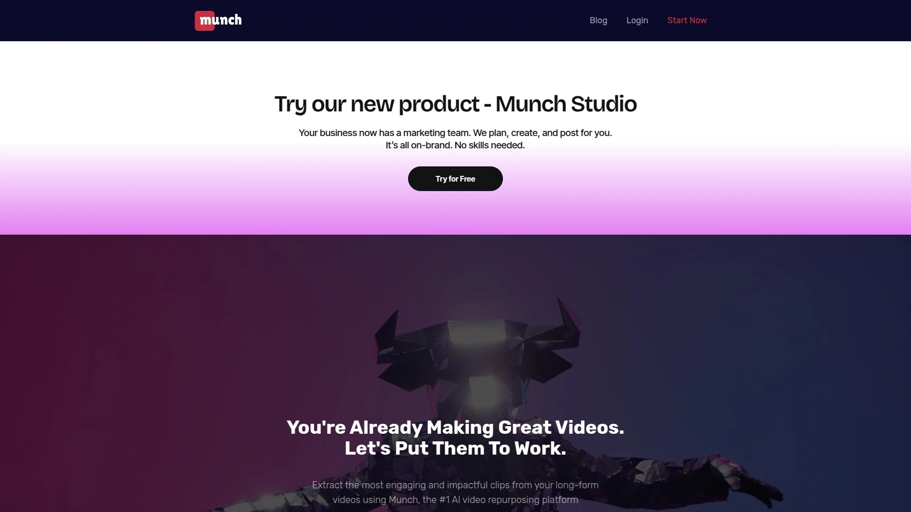

Munch employs computer vision and natural language processing to analyze gestures, faces, overlays, objects, plus spoken keywords, people, brands, locations, and topics from uploaded videos. These data points feed the clip generation engine, which evaluates coherence, excitement, and engagement metrics to select segments with viral potential. Keyword and topic research charts show search volume, trending keywords, brands, and topics for each generated clip.

Social media optimization tools adjust aspect ratios and timeframes automatically, with manual fine-tuning available through a dedicated editor. Magic Posts feature generates captions with hashtags specifically formatted for TikTok, Instagram, and Twitter, ready to schedule. Publish Manager displays all scheduled content across platforms in one dashboard with direct editing capabilities.

**Integrations** with TikTok, Instagram, and YouTube enable automatic cross-posting when clips publish. The platform determines "trendability" of each clip and writes social post copy matched to current platform trends. Setup requires selecting target platform, uploading video or YouTube link, choosing subtitle template, and specifying optimal clip length before Munch processes everything.

***

## **[Submagic](https://www.submagic.co)**

AI-powered short-form video creator with clip detection, auto-framing, animated emojis, and 99% caption accuracy in 48 languages for teams and businesses.

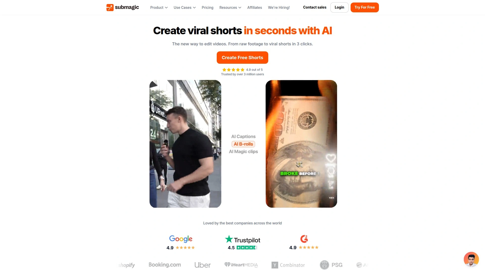

Submagic identifies key moments in long videos and automatically generates multiple clips with vertical formatting for TikTok, YouTube Shorts, and Instagram Reels. The AI clip detection highlights segments that engage audiences most effectively, expanding your reach by repurposing one long video across multiple social channels. Auto-framing centers subjects perfectly in portrait format without manual adjustment.

Animated subtitles include emojis, colors, and GIFs for visual interest, achieving 99% accuracy across 48 languages. Auto B-Roll adds royalty-free stock footage or accepts your own clips in one click, while auto-transitions create smooth movement between segments. Auto-zoom generates dynamic transitions and auto-cut removes silence with minimal effort.

AI-generated descriptions and hashtags optimize videos for social algorithms. Magic Clips feature turns lengthy content into viral shorts by identifying 20+ potential clips in minutes. Text-based trimming lets you remove scenes by deleting transcript text—no timeline scrubbing required. Sound effects, background music, and image additions round out the comprehensive editing toolkit.

---

## **[Vmaker AI](https://www.vmaker.com)**

Free AI clip maker that converts long videos to shorts with keyword-based segmentation and virality scoring for Instagram, YouTube, and TikTok optimization.

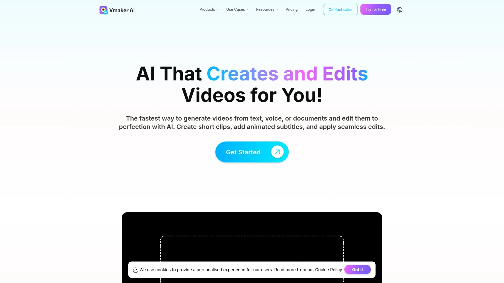

Vmaker AI generates short videos from long content in minutes by identifying highlight snippets based on keywords you provide. The platform calculates virality scores for each clip across different social platforms, recommending which network (Instagram, YouTube, or TikTok) will yield best performance. Keyword-driven processing ensures extracted clips match your content themes and target audience interests.

Custom duration settings let you specify timeframes like 20-40 seconds, 40-60 seconds, or 60-120 seconds depending on platform requirements and audience attention spans. Aspect ratio selection (16:9, 9:16, or 1:1) happens before or after upload with manual resize options available. AI-generated subtitles come standard, with customizable style options for brand consistency.

The tool stays on top of social media trends by suggesting optimal content lengths and formats for current algorithm preferences. Bank deposit matching happens instantly, and month-end close accelerates since reconciliation completes automatically. One-click conversion eliminates manual video editing perfection, making short-form content production accessible to non-editors.

---

## **[Adobe Express Clip Maker](https://www.adobe.com/express)**

Quick video converter from Adobe that turns long videos into social-first clips with AI-identified key moments and built-in Content Scheduler for multi-platform publishing.

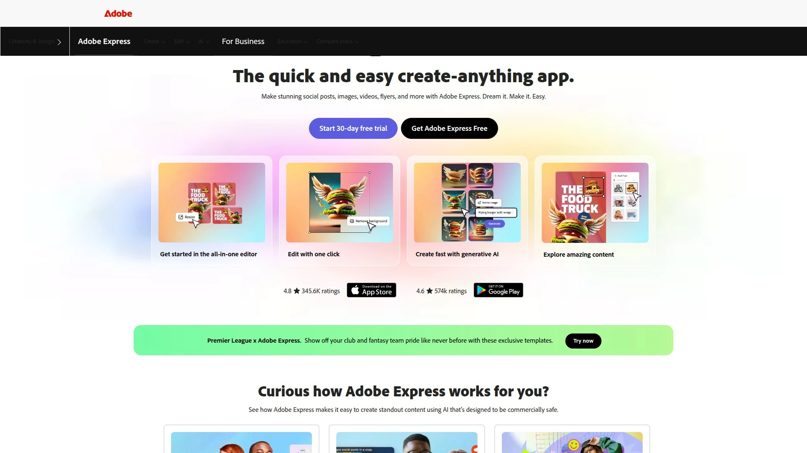

Adobe Express Clip Maker focuses on speed and simplicity—upload videos and watch the AI extract attention-grabbing moments into ready-to-share clips. The platform identifies compelling hooks and highlights designed to maximize engagement across social channels. AI-generated subtitles appear automatically with full customization available in the editor.

Branding tools let you apply consistent visual identity elements across all clips, while animation options add polish to static elements. Integration with TikTok's Commercial Music Library via TikTok Symphony Assistant provides trending sounds and royalty-free soundtracks directly in Adobe Express. Content Scheduler eliminates manual posting by publishing clips to Instagram Reels, TikTok, YouTube Shorts, and other platforms at scheduled times when your audience is most active.

Preview functionality shows exactly how content will appear on each platform before publishing, preventing formatting surprises. The tool helps repurpose existing long-form content for short-form distribution, maximizing ROI on video production investments. Adobe Express operates on a freemium model with no credit card required for basic features.

---

## **[Repurpose.io](https://repurpose.io)**

Content distribution automation platform that downloads videos from YouTube and automatically publishes them to Instagram Reels, TikTok, LinkedIn, Facebook, and 10+ other platforms.

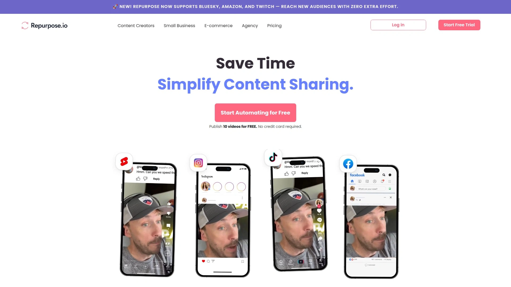

Repurpose.io handles the entire distribution workflow—connect your YouTube account plus destination social channels, create unlimited workflows between platforms, and turn on Auto Publish. Each new YouTube upload automatically gets distributed everywhere without manual intervention. The system downloads YouTube videos, Shorts, and Lives, then republishes to Instagram Reels, Twitter, LinkedIn, Facebook, Pinterest, TikTok, Google Drive, and Dropbox.

Create unlimited clips from long videos or publish entire videos intact. Automatic conversion to vertical and square formats ensures proper display on mobile-first platforms. Caption and headline burning embeds text directly into videos for accessibility and engagement. Template customization applies consistent formatting across all distributed content.

**14-day trial** includes 10 free video repurposing credits with no credit card required. The platform saves weekend hours previously spent on manual video conversion and uploading. Choose specific videos for distribution or automate everything for hands-off content multiplication.

***

## **[Chopcast](https://www.chopcast.io)**

Video repurposing platform for webinars and podcasts that auto-generates clips, creates speaker-specific segments, and produces topic-based shorts with advanced editing mode.

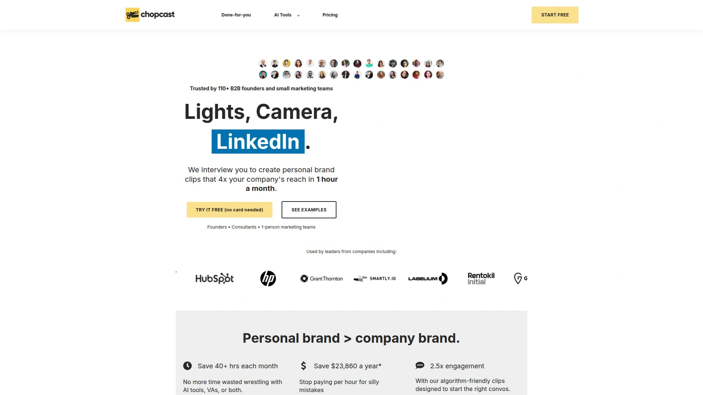

Chopcast specializes in repurposing business webinars, podcasts, and virtual events into digestible clips, audio, and images formatted for social discovery. Auto-generated clips appear immediately after upload with instant download capability. Editing tools include clip-by-speaker creation and topic-based segmentation—useful when multiple people appear in recordings or content covers distinct subjects.

Vertical and square video creation adapts landscape content for Instagram Reels, TikTok, and mobile-optimized platforms. Text and image overlay features enhance clips with branding elements, calls-to-action, or context-setting visuals. Audio podcast generation extracts just the sound from video files, providing flexibility for audio-only distribution channels.

Automatic transcription generates searchable text from all videos, improving SEO and accessibility. Advanced editing mode offers deeper control for complex projects requiring precise adjustments. The platform turns dormant content libraries into revenue-generating assets by making webinars and virtual events continuously discoverable in formats audiences prefer.

***

## **[LiveLink](https://www.livelink.ai)**

Intuitive AI video generator with simplified workflow for beginners that automates clip selection, arrangement, and caption customization with 7-day trial access.

LiveLink's AI video generator automates the clip creation process by analyzing long-form videos, identifying key moments, and arranging segments logically without manual editing. Advanced algorithms remove the hard work from video editing while maintaining professional output quality. The tool performs well with educational videos, video podcasts, speeches, product reviews, and commentary content.

User-friendly interface makes video editing accessible even for complete beginners, with hassle-free tools that don't require technical expertise. Generated clips remain fully customizable—add personal branding, adjust pacing, refine selections, and polish final output. AI automatically adds captions with options to change text, modify caption style, and adjust display methods.

Use cases span promotional content, social media clips, and highlight reels across multiple industries and content types. **7-day trial** lets you test full functionality before selecting a paid plan tailored to your specific requirements. The platform simplifies workflows for content creators who want consistent social media presence without dedicating hours to video editing.

***

## How long does AI clip generation actually take?

Most AI video clipping tools process a 60-minute video in 5-15 minutes, with results varying based on video length, resolution, and platform server load. Upload time depends on your internet connection, while AI analysis happens on cloud servers. Platforms like Klap and Vmaker AI emphasize speed, often delivering clips in under 10 minutes for standard podcast-length content. More complex analysis that includes virality scoring, keyword research, and multi-language captioning may extend processing to 15-20 minutes for comprehensive results.

## Can these tools handle videos with multiple speakers and camera angles?

Yes, advanced platforms like Vizard.ai and Spikes Studio include speaker identification and scene detection specifically for multi-person content. The AI recognizes different voices, tags speakers, and maintains proper framing when camera angles switch between participants. Chopcast offers dedicated clip-by-speaker functionality, letting you extract segments featuring specific individuals from panel discussions or interview formats. This capability proves essential for podcasts, webinars, and conference recordings where multiple people contribute throughout the content.

## Do AI-generated clips perform better than manually edited ones?

AI-generated clips perform comparably when platforms analyze successful content patterns, with tools like Opus.pro's Virality Score providing data-driven selection that often outperforms gut instinct. The advantage isn't necessarily quality but volume and consistency—AI lets you test 10+ clips from one video instead of manually creating 2-3, then double down on proven performers. Manual editing still wins for highly stylized content requiring specific creative vision, but automated tools excel at maintaining regular posting schedules and identifying unexpected viral moments human editors might overlook.

---

Transforming long-form video content into consistent social media clips no longer requires editing skills or hours of timeline work. The tools above automate everything from moment identification to caption generation, letting you focus on creating quality source material rather than repetitive editing tasks. [Opus.pro](https://www.opus.pro) stands out for creators and marketers who need reliable virality prediction and multi-platform optimization—the AI Virality Score eliminates guessing games while custom branding and one-click publishing handle distribution seamlessly across TikTok, Instagram Reels, YouTube Shorts, and LinkedIn. Start with their Guided Setup Wizard to process your first video and see how automated clipping multiplies your content reach without expanding your team.
